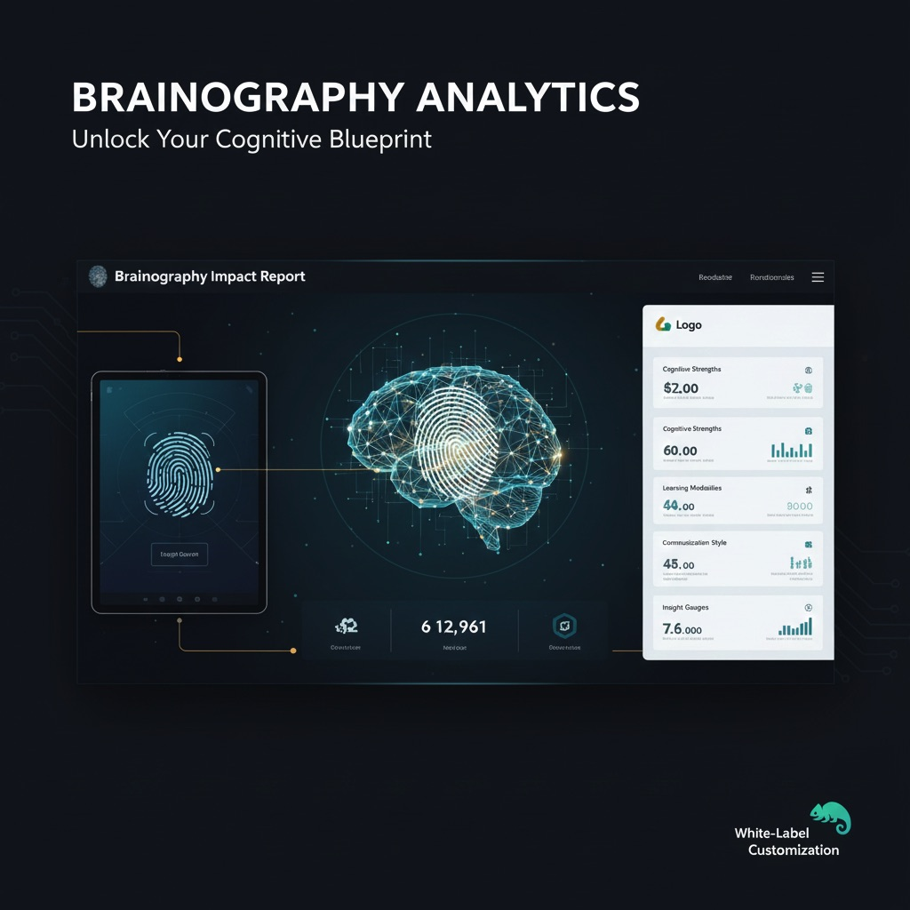

# Project-Brainography

  

## 🧠 About the Project
**Project-Brainography** is a sophisticated, web-based biometric analysis platform. It leverages dermatoglyphics—the study of fingerprint ridge counts and pattern types—to generate comprehensive **Impact Reports**. This system provides deep insights into innate potential and behavioral traits through structured data analysis.

## ✨ Key Features
* **Biometric Analysis:** Advanced algorithms to calculate ridge counts and identify pattern types (Arch, Loop, Whorl).
* **Automated Report Generation:** Instantly generates structured "Brainography Impact Reports" with actionable insights.
* **White-Label Customization:** Designed for scalability, allowing organizations to deploy the platform under their own branding.
* **Elegant UI/UX:** A clean, professional dashboard for both administrators and end-users.
* **Data Security:** Enterprise-grade handling of sensitive biometric metadata.

## 🛠️ How It Works
1.  **Input:** User fingerprint data (ridge counts and patterns) is entered into the system.
2.  **Processing:** The engine analyzes the distribution across different brain lobes based on established dermatoglyphic research.
3.  **Output:** A high-quality, branded PDF report is generated, detailing the individual's "Brainography" profile.

## 🚀 Deployment & Usage
### Prerequisites
* Node.js / Python (depending on your backend)
* Modern Web Browser
